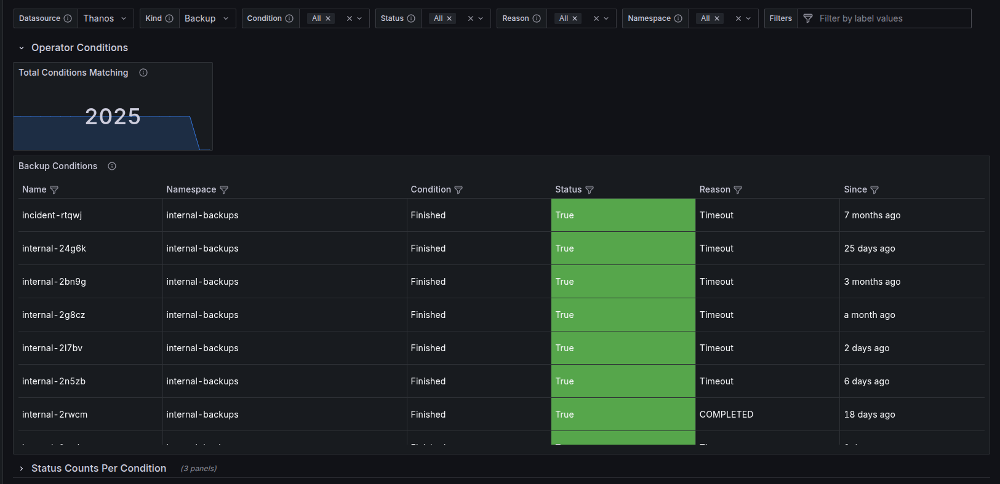

# CRD Condition Metrics

A simple and easy to integrate metric recording utility for kubernetes operators, giving you metrics
which are representative and kept in line with your [CRD status Conditions](https://github.com/kubernetes/community/blob/master/contributors/devel/sig-architecture/api-conventions.md#typical-status-properties).

This package is built on the [Prometheus GaugeVecSet implementation for go](https://github.com/sourcehawk/go-prometheus-gaugevecset).

Features:
- Provides consistency between your custom resource statuses and your metrics:
   >  The metrics are based on your status conditions and synced when you update the conditions
- Easy integration:
   > Get metrics anywhere with little initial setup and a simple method calls
- Light weight and performant
   > Small memory footprint at large scale, fast ops
- Keeps cardinality under control
    > Only 1 metric series per (custom resource, condition type) combination, even with 10 unique labels!
- A dashboard is available to get you started!
  

---

## Motivation

Creating metrics for custom resources is an important topic for any operator or controller.
However, how to standardize these metrics and ensure they consistently represent the state of our custom resources is not 
something I've seen.

As `status.condtions` have become today's de facto standard to representing state of custom resources, it only makes 
sense to utilize these conditions for metric recording.

The `ConditionMetricsRecorder` is an implementation wrapper of `GaugeVecSet` for kubernetes operators.

The metric is somewhat inspired by kube-state-metrics patterns for metrics such as `kube_pod_status_phase`. 
Kube state metrics exports one time series per phase for each (namespace, pod), and marks exactly one as active (1) 
while the others are inactive (0).

Example:

```
kube_pod_status_phase{namespace="default", pod="nginx", phase="Running"} 1
kube_pod_status_phase{namespace="default", pod="nginx", phase="Pending"} 0
kube_pod_status_phase{namespace="default", pod="nginx", phase="Failed"}  0
```

We adopt the same pattern for controller conditions, but we export only one time series per (custom resource, condition) 
variant, meaning we delete all other variants in the group when we set the metric (e.g. we'd remove the "Pending" and 
"Failed" metric in `kube_pod_status_phase`). This ensures the cardinality stays under control, as we at most have 
`CR count * CR ConditionType` amount of series per CRD.

Additionally, rather than using the value 1/0 indicating the activeness of the metric, which in our case is pointless 
(we only expose the active metric), we set the last transition time of the condition as the value (unix timestamp), 
allowing us to determine at what point in time the custom resource went into the current state.

Example metric:

```
my_operator_controller_condition{
    controller="my_controller",
    kind="MyCR",
    name="my-cr",
    namespace="default",
    condition="Ready",
    status="False",
    reason="FailedToProvision"
} 17591743210
```

### Operator Initialization

The metric should be initialized and registered once.

You can embed the `ConditionMetricRecorder` in your controller's recorder.

```go
package my_metrics

import (
    controllermetrics "sigs.k8s.io/controller-runtime/pkg/metrics"
    ccm "github.com/sourcehawk/go-crd-condition-metrics/pkg/crd-condition-metrics"
)

// We need this variable later to create the ConditionMetricsRecorder
var OperatorConditionsGauge *ccm.OperatorConditionsGauge

// Initialize the operator condition gauge once
func init() {
    OperatorConditionsGauge = ccm.NewOperatorConditionsGauge("my_operator")
    controllermetrics.Registry.MustRegister(OperatorConditionsGauge)
}

// Embed in existing metrics recorder
type MyControllerRecorder struct {
	ccm.ConditionMetricRecorder
}
```

When constructing your reconciler, initialize the condition metrics recorder with the
operator conditions gauge and a unique name for each controller.

_cmd/main.go_
```go
package main

import (
    mymetrics "path/to/pkg/my_metrics"
	ccm "github.com/sourcehawk/go-crd-condition-metrics/pkg/crd-condition-metrics"
)

func main() {
    // ...
    recorder := mymetrics.MyControllerRecorder{
        ConditionMetricRecorder: ccm.ConditionMetricRecorder{
            Controller: "my-controller", // unique name per reconciler
            OperatorConditionsGauge: mymetrics.OperatorConditionsGauge,
        },
    }
	
    reconciler := &MyReconciler{
        Recorder: recorder, 
    }
    // ...
}
```

## Controller Usage

The easiest drop-in way to start using the metrics recorder is by creating a `SetStatusCondition` wrapper, which
comes instead of `meta.SetStatusCondition`. We call `RecordConditionFor` to record our metrics.

To delete the metrics for a given custom resource, simply call `RemoveConditionsFor` and pass the object.

```go
const (
	kind = "MyCR"
)

// SetStatusCondition utility function which replaces and wraps meta.SetStatusCondition calls
func (r *MyReconciler) SetStatusCondition(cr *v1.MyCR, cond metav1.Condition) bool {
    changed := meta.SetStatusCondition(&cr.Status.Conditions, cond)
    // refetch the condition to get the updated version
    updated := meta.FindStatusCondition(cr.Status.Conditions, cond.Type)
    if updated != nil {
        r.Recorder.RecordConditionFor(
            kind, cr, updated.Type, string(updated.Status), updated.Reason, updated.LastTransitionTime,
        )
    }
    return changed
}

func (r *MyReconciler) Reconcile(ctx context.Context, req ctrl.Request) (ctrl.Result, error) {
    // Get the resource we're reconciling
    cr := new(v1.MyCR)
    if err = r.Get(ctx, req.NamespacedName, cr); err != nil {
        return ctrl.Result{}, client.IgnoreNotFound(err)
    }
	
    // Remove the metrics when the CR is deleted
    if cr.DeletionTimeStamp != nil {
        r.Recorder.RemoveConditionsFor(kind, cr)
    }
	
    // ...
	
    // Update the status conditions using the recorder (it records the metric if changed)
    if r.SetStatusCondition(cr, condition) {
        if err = r.Status().Update(ctx, cr); err != nil {
            return ctrl.Result{}, err
        }
    }
	
    return ctrl.Result{}, nil
}
```

## PromQL usage examples

Here are some examples of how we can query the metrics. 

The examples assume the `OperatorConditionsGauge` was
initialized with the namespace `my_operator` which results in the metric name being `my_operator_controller_condition`.

In code:
```go
OperatorConditionsGauge = ccm.NewOperatorConditionsGauge("my_operator")
```

> [!INFO] Most of the time, the `namespace` label is reserved by the pod scraping the metrics. 
> The `namespace` label we set is therefore in most cases labeled as `exported_namespace`.
> **The examples do not assume this to be the case.**

---

Get all CR's of kind `App` that have the condition `Ready` set to `False`.

```promql
my_operator_controller_condition{
    kind="App",
    condition="Ready",
    status="False",
}
```

Output:

```
my_operator_controller_condition{condition="Ready", controller="myctrlr", namespace="ns-1", id="ns-1/my-app-1", kind="App", name="my-app-1", reason="Foo", status="False"} 1759416292
my_operator_controller_condition{condition="Ready", controller="myctrlr", namespace="ns-1", id="ns-1/my-app-2", kind="App", name="my-app-2", reason="Bar", status="False"} 1759329097
my_operator_controller_condition{condition="Ready", controller="myctrlr", namespace="ns-2", id="ns-2/my-app", kind="App", name="my-app", reason="Foo", status="False"} 1759329145
my_operator_controller_condition{condition="Ready", controller="myctrlr", namespace="ns-3", id="ns-3/my-app", kind="App", name="my-app", reason="Foo", status="False"} 1759406280
```

---

Count the number of CR's of kind `App` that have `Ready` condition status `False`

```
count(
  my_operator_controller_condition{
    kind="App",
    condition="Ready",
    status="False",
  } > 0
)
```

Output:

```
4
```